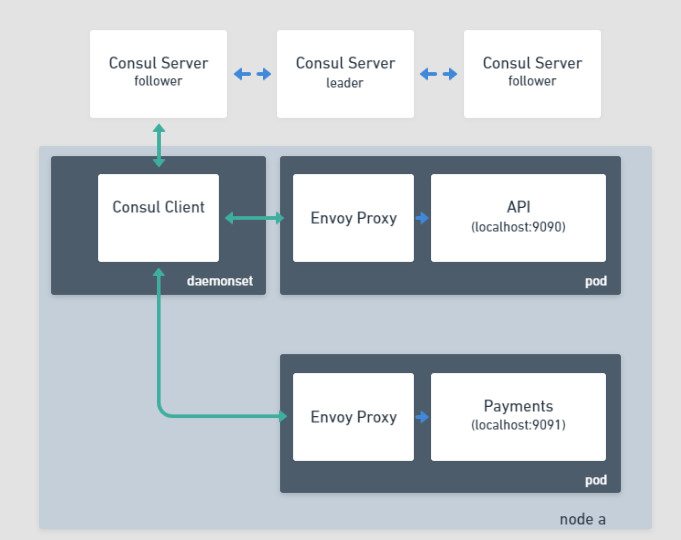
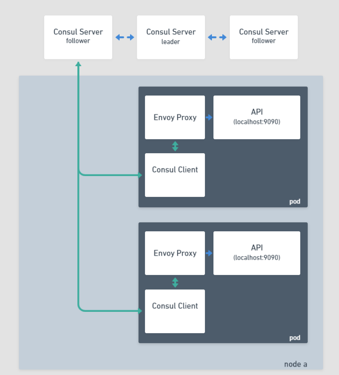

# EKS Fargate Consul Sidecar Injector

Consul Service Mesh for Kubernetes automatically injects the sidecar containers for the service mesh data plane when it detects the presence
of the annotation `'consul.hashicorp.com/connect-inject': 'true'`

```yaml
metadata:
  name: static-server
  annotations:
    'consul.hashicorp.com/connect-inject': 'true'
```

The proxies (data plane) injected by the Consul communicate with the Consul server via an intermediary agent called a Consul client, this allows
local caching of data and distributed load for the control plane. 

In a typical setup these agents run in a Kubernetes Daemonset, however Daemonsets are not currently supported by EKS Fargate at present and
this stops the injection process from functioning correctly. 



The HashiCorp Consul team is aware of this limitation with Fargate and is working on an official fix to change the function of the proxy injector
for EKS Fargate. Until this has been completed this repo contains a simple utility that appends the necessary containers and volumes to your Deployments
allowing them to participate in the service mesh.  



**NOTE: The current release does not support ACL Tokens**

## Usage

```
Injects Consul service mesh containers to Kubernetes Deployments
e.g. To inject containers for the service 'web' running on port '9090' with the upstream 'api:9091'

consul-injection \
        --upstreams "api:9091" \
        --deployment ./example/web.yaml \
        --service web --port 9090 \
        > output.yaml

Usage of /tmp/go-build684716463/b001/exe/main:
  -deployment string
        Path to the kubernetes deployment file to manipulate
  -help
        Usage instructions
  -port string
        Port the service is exposed on
  -service string
        Name of the service to create in Consul
  -upstreams string
        Space delimited string of upstream services to add. e.g: api:9090 web:9091
  -acl-enabled
        ACLs are enabled for the server, setting this option will enable consul login using the service account token
```

Given the standard Kubernetes deployment `web.yaml`:

```yaml
---
apiVersion: apps/v1
kind: Deployment
metadata:
  labels:
    app: web
  name: web
spec:
  replicas: 1
  selector:
    matchLabels:
      app: web
  template:
    metadata:
      labels:
        app: web
        metrics: enabled
    spec:
      containers:
      - env:
        - name: LISTEN_ADDR
          value: 127.0.0.1:9090
        - name: NAME
          value: web
        - name: MESSAGE
          value: Response from Web
        - name: UPSTREAM_URIS
          value: http://localhost:9091
        image: nicholasjackson/fake-service:v0.20.0
        name: web
        ports:
        - containerPort: 9090
```

Running the following command would inject the necessary containers to allow this deployment to be part of the service mesh
and provides access to the upstream service `api` at `localhost:9090`.

```shell
consul-injection \
        --upstreams "api:9091" \
        --deployment ./example/web.yaml \
        --service web --port 9090 \
        > output.yaml
```

The transformed deployment will look like:

```yaml

```
